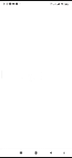

# Teste para Vaga no iFood

Este projeto foi desenvolvido como parte de um teste técnico para uma vaga na equipe do iFood. Ele demonstra minhas habilidades no desenvolvimento de aplicativos utilizando o framework Expo.
<p align="center">
  
  
</p>

## ️ Configuração do Projeto

Siga os passos abaixo para instalar e rodar o projeto:

### 1️⃣ Pré-requisitos

Certifique-se de ter instalado em sua máquina:

*   **Node.js** (versão 14 ou superior)
*   **npm** ou **yarn**
*   **Expo CLI** (opcional, mas recomendado)

### 2️⃣ Clonando o Repositório

Faça o clone do repositório para sua máquina local:

```bash
git clone <URL_DO_REPOSITORIO>
cd <NOME_DO_PROJETO>
3️⃣ Instalando as Dependências
No diretório do projeto, execute:

Bash

npm install
ou, se preferir:

Bash

yarn install
4️⃣ Iniciando o Projeto
Para iniciar o servidor do Expo, rode:

Bash

npx expo start
ou:

Bash

yarn start
5️⃣ Rodando o App no Celular com Expo Go
Android: Escaneie o QR Code com o aplicativo Expo Go (disponível na Play Store).
iOS: Escaneie o QR Code com a câmera do seu dispositivo ou use o aplicativo Expo Go (disponível na App Store).
Após isso, o app será carregado diretamente no dispositivo.

Estrutura do Projeto
A estrutura segue o padrão do Expo Router, com suporte a rotas baseadas em arquivos. Os arquivos principais estão localizados na pasta app/. Você pode começar a desenvolver alterando ou adicionando arquivos dentro dessa pasta.

├── app/                  # Rotas e componentes do aplicativo
│   ├── _layout.tsx        # Layout principal do aplicativo
│   ├── index.tsx          # Tela inicial
│   └── ...                # Outras rotas e componentes
├── assets/               # Recursos estáticos (imagens, ícones, etc.)
├── app.json             # Configurações do Expo
├── package.json         # Dependências e scripts do projeto
└── ...

Resetando o Projeto
Se precisar começar do zero, você pode resetar o projeto com o comando:

Bash

npm run reset-project
Isso irá mover o código atual para a pasta app-example/ e criar um diretório vazio app/ para iniciar um novo desenvolvimento.

Referências
Confira mais sobre o desenvolvimento com Expo nas documentações oficiais:

Documentação do Expo
Guia de Rotas com Expo Router
Comunidade
Participe da comunidade de desenvolvedores Expo:

Repositório no GitHub
Comunidade no Discord
Se tiver dúvidas ou sugestões sobre o projeto, fique à vontade para entrar em contato!
